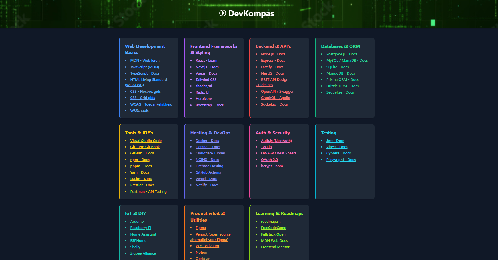

# DevKompas

**DevKompas** is een persoonlijke startpagina voor ontwikkelaars en makers.  
Het verzamelt de belangrijkste links, tools, documentatie en platforms rond webontwikkeling, programmeren, IoT en DevOps in een overzichtelijke, visueel herkenbare grid.

## 🌐 Beschrijving

Deze pagina is gebouwd met:

* **HTML5**
* **Tailwind CSS** (CDN)
* **Custom CSS** voor tooltips (`tooltips.css`)
* Een **donker thema** met gekleurde categorieën
* Ondersteuning voor vier kolommen bij grotere schermen (responsief)

## 📁 Categorieën

Elke categorie heeft een unieke kleur, bevat relevante links en toont bij hover een korte beschrijving via tooltips:

* **Web Development Basics** – HTML, CSS, JavaScript, TypeScript, W3Schools, MDN
* **Frontend Frameworks & Styling** – React, Next.js, Vue.js, Tailwind, shadcn/ui, Radix UI, Heroicons, Bootstrap
* **Backend & API's** – Node.js, Express, Fastify, NestJS, REST design, Swagger, GraphQL, Socket.io
* **Databases & ORM** – PostgreSQL, MySQL/MariaDB, SQLite, MongoDB, Prisma, Drizzle, Sequelize
* **Tools & IDE's** – VS Code, Git/GitHub, npm, pnpm, Yarn, ESLint, Prettier, Postman
* **Hosting & DevOps** – Docker, Hetzner, Cloudflare, NGINX, Firebase Hosting, GitHub Actions, Vercel, Netlify
* **Auth & Security** – Auth.js (NextAuth), JWT, OWASP, OAuth 2.0, bcrypt
* **Testing** – Jest, Vitest, Cypress, Playwright
* **IoT & DIY** – Arduino, Raspberry Pi, Home Assistant, ESPHome, Shelly, Zigbee
* **Productiviteit & Utilities** – Figma, Penpot, W3C Validator, Notion, Obsidian, Canva
* **Learning & Roadmaps** – roadmap.sh, FreeCodeCamp, Fullstack Open, MDN, Frontend Mentor

## 🧭 Functionaliteit

* Elke link opent in een nieuw tabblad met `rel="noopener noreferrer"`.
* Hover-tooltips per link met korte beschrijving (zie `tooltips.css`).
* Grid-layout met Tailwind: 1–4 kolommen afhankelijk van schermgrootte.
* Responsief ontwerp, geoptimaliseerd voor desktop.

## 📷 Afbeelding

De header bevat een matrix-achtige achtergrondafbeelding:

```
/images/matrix.png
```

### Voorbeeld van de DevKompas-pagina



*(Zorg dat je een screenshot van de pagina opslaat als `images/devkompas-preview.png`)*

## 💡 Mogelijke uitbreidingen

* Licht/donker-modus toggle
* Zoekfunctie per categorie
* Persoonlijke login voor aangepaste links
* Icons per link (bijv. React-logo bij React)

## 🗂 Bestandstructuur

```
DevKompas/
├── index.html
├── tooltips.css
├── images/
│   ├── matrix.png
│   └── devkompas-preview.png
└── README.md
```

## 🧑‍💻 Gemaakt door

Dio Edelschaap – 2025
